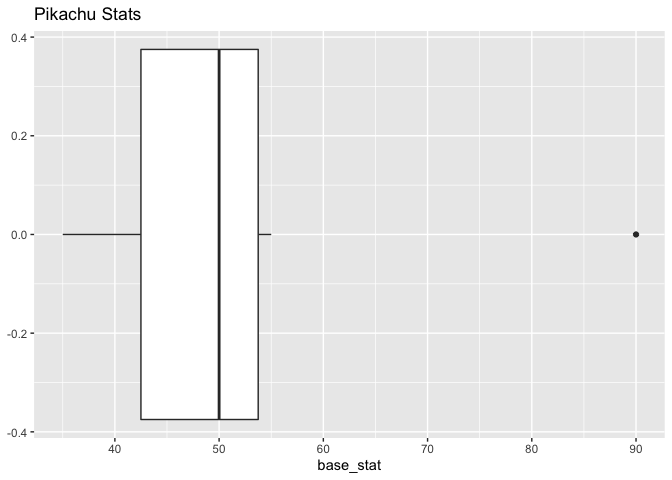
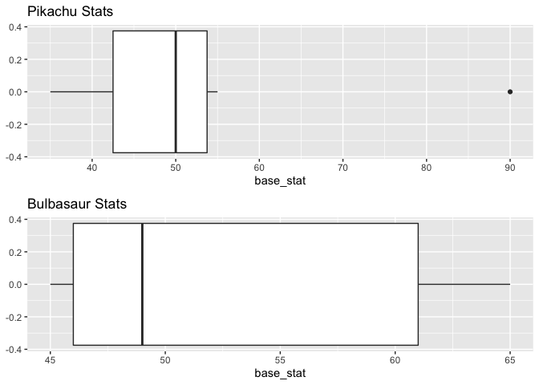

Pokemon API Vignette
================

# Pokemon API

This vignette will show how to contact the Pokemon API
(<https://pokeapi.co/docs/v2>) and how to use the functions provided.

## Required packages

The following are the packages required to use the Pokemon API
functions.

``` r
install.packages(c("httr", "jsonlite", "tidyverse", "gridExtra"))
```

-   “httr” is used to help make the HTTP calls for the API
-   “jsonlite” is used to help parse the JSON data into an R list
-   “tidyverse” is used to help mutate data, specifically for unnesting
    collections to make them into a flat data frame
-   “gridExtra” is used to allow multiple grids in the same output
-   “ggplot2” is used to make all of the plots

Then use the below code to load in the packages in to the R session.

``` r
# Load packages
library(httr)
library(jsonlite)
library(tidyverse)
library(gridExtra)
library(ggplot2)
```

## Getting Pokemon Character Information

The first method will be getting Pokemon character information. This
will give main attributes and stats on any Pokemon character. For
example, if we want stats from Pikachu we can call the following code:

``` r
ret <- get_pokemon_character("pikachu")
```

And can get information from the character from the return object, such
as the character’s stats.

``` r
ret$stats
```

    ## # A tibble: 6 × 4
    ##   base_stat effort name            url                              
    ##       <int>  <int> <chr>           <chr>                            
    ## 1        35      0 hp              https://pokeapi.co/api/v2/stat/1/
    ## 2        55      0 attack          https://pokeapi.co/api/v2/stat/2/
    ## 3        40      0 defense         https://pokeapi.co/api/v2/stat/3/
    ## 4        50      0 special-attack  https://pokeapi.co/api/v2/stat/4/
    ## 5        50      0 special-defense https://pokeapi.co/api/v2/stat/5/
    ## 6        90      2 speed           https://pokeapi.co/api/v2/stat/6/

### Exploratory Data Analysis

We can explore the data further by doing some analysis on it. For
instance, we may want to see a box plot of the base stat.

``` r
pikachu_stats <- ggplot(ret$stats, aes(x=base_stat)) +
  ggtitle("Pikachu Stats") +
  geom_boxplot()

pikachu_stats
```

<!-- -->

And we can do this with multiple characters. Let’s also get the
character stats from Bulbasaur and compare his stats with Pikachu’s.

``` r
bulbasaur <- get_pokemon_character("bulbasaur")
```

    ## Warning: `cols` is now required when using unnest().
    ## Please use `cols = c(stat)`

``` r
bulbasaur
```

    ## $name
    ## [1] "bulbasaur"
    ## 
    ## $stats
    ## # A tibble: 6 × 4
    ##   base_stat effort name            url                              
    ##       <int>  <int> <chr>           <chr>                            
    ## 1        45      0 hp              https://pokeapi.co/api/v2/stat/1/
    ## 2        49      0 attack          https://pokeapi.co/api/v2/stat/2/
    ## 3        49      0 defense         https://pokeapi.co/api/v2/stat/3/
    ## 4        65      1 special-attack  https://pokeapi.co/api/v2/stat/4/
    ## 5        65      0 special-defense https://pokeapi.co/api/v2/stat/5/
    ## 6        45      0 speed           https://pokeapi.co/api/v2/stat/6/
    ## 
    ## $gameIndex
    ##  [1] 153 153 153   1   1   1   1   1   1   1   1   1   1   1   1   1   1   1   1   1

``` r
bulbasaur_stats <- ggplot(bulbasaur$stats, aes(x=base_stat)) +
  ggtitle("Bulbasaur Stats") +
  geom_boxplot()

grid.arrange(pikachu_stats, bulbasaur_stats)
```

<!-- -->

When comparing the two box plots we can see that the base stats of
Bulbasaur is much wider than the base stats of Pikachu. We can also see
that Pikachu has a stat that is an outlier from the other stats.

## Get Pokemon Items

The next method will return information on a specific Pokemon item. This
method can take in either the item name or th e numerical ID of the item
in the database.

For instance if we want the first item, we can call the method with the
ID of 1.

``` r
item <- get_item(1)

item
```

    ## $name
    ## [1] "master-ball"
    ## 
    ## $categoryName
    ## [1] "standard-balls"
    ## 
    ## $short_desc
    ## [1] "Catches a wild Pokémon every time."

This returns the item of “master-ball” and we can use this in the same
method to get the data.

``` r
master_ball <- get_item("master-ball")

master_ball
```

    ## $name
    ## [1] "master-ball"
    ## 
    ## $categoryName
    ## [1] "standard-balls"
    ## 
    ## $short_desc
    ## [1] "Catches a wild Pokémon every time."

## Get Abilities List

We can get all abilities, as well, using the `get_abilities` function.
This takes in an optional integer value for the count. By default, the
count is 10.

``` r
ret <- get_abilities()

ret
```

    ##            name                                   url
    ## 1        stench  https://pokeapi.co/api/v2/ability/1/
    ## 2       drizzle  https://pokeapi.co/api/v2/ability/2/
    ## 3   speed-boost  https://pokeapi.co/api/v2/ability/3/
    ## 4  battle-armor  https://pokeapi.co/api/v2/ability/4/
    ## 5        sturdy  https://pokeapi.co/api/v2/ability/5/
    ## 6          damp  https://pokeapi.co/api/v2/ability/6/
    ## 7        limber  https://pokeapi.co/api/v2/ability/7/
    ## 8     sand-veil  https://pokeapi.co/api/v2/ability/8/
    ## 9        static  https://pokeapi.co/api/v2/ability/9/
    ## 10  volt-absorb https://pokeapi.co/api/v2/ability/10/

If we wanted to get 20 items return, we can specify that.

``` r
ret <- get_abilities(20)

ret
```

    ##             name                                   url
    ## 1         stench  https://pokeapi.co/api/v2/ability/1/
    ## 2        drizzle  https://pokeapi.co/api/v2/ability/2/
    ## 3    speed-boost  https://pokeapi.co/api/v2/ability/3/
    ## 4   battle-armor  https://pokeapi.co/api/v2/ability/4/
    ## 5         sturdy  https://pokeapi.co/api/v2/ability/5/
    ## 6           damp  https://pokeapi.co/api/v2/ability/6/
    ## 7         limber  https://pokeapi.co/api/v2/ability/7/
    ## 8      sand-veil  https://pokeapi.co/api/v2/ability/8/
    ## 9         static  https://pokeapi.co/api/v2/ability/9/
    ## 10   volt-absorb https://pokeapi.co/api/v2/ability/10/
    ## 11  water-absorb https://pokeapi.co/api/v2/ability/11/
    ## 12     oblivious https://pokeapi.co/api/v2/ability/12/
    ## 13    cloud-nine https://pokeapi.co/api/v2/ability/13/
    ## 14 compound-eyes https://pokeapi.co/api/v2/ability/14/
    ## 15      insomnia https://pokeapi.co/api/v2/ability/15/
    ## 16  color-change https://pokeapi.co/api/v2/ability/16/
    ## 17      immunity https://pokeapi.co/api/v2/ability/17/
    ## 18    flash-fire https://pokeapi.co/api/v2/ability/18/
    ## 19   shield-dust https://pokeapi.co/api/v2/ability/19/
    ## 20     own-tempo https://pokeapi.co/api/v2/ability/20/

## Get Pokemon Character List

The first function returned information from a single Pokemon character,
but what if we wanted a list of all characters? The `get_pokemon` method
can give us the list.

Similar to the abilities function, the `get_pokemon` function takes in
an integer parameter to tell how many results to return. By default, it
also returns 10 items.

``` r
ret <- get_pokemon()

ret
```

    ##          name                                   url
    ## 1   bulbasaur  https://pokeapi.co/api/v2/pokemon/1/
    ## 2     ivysaur  https://pokeapi.co/api/v2/pokemon/2/
    ## 3    venusaur  https://pokeapi.co/api/v2/pokemon/3/
    ## 4  charmander  https://pokeapi.co/api/v2/pokemon/4/
    ## 5  charmeleon  https://pokeapi.co/api/v2/pokemon/5/
    ## 6   charizard  https://pokeapi.co/api/v2/pokemon/6/
    ## 7    squirtle  https://pokeapi.co/api/v2/pokemon/7/
    ## 8   wartortle  https://pokeapi.co/api/v2/pokemon/8/
    ## 9   blastoise  https://pokeapi.co/api/v2/pokemon/9/
    ## 10   caterpie https://pokeapi.co/api/v2/pokemon/10/

And if we wanted 15 results, we can pass that in.

``` r
ret <- get_pokemon(15)

ret
```

    ##          name                                   url
    ## 1   bulbasaur  https://pokeapi.co/api/v2/pokemon/1/
    ## 2     ivysaur  https://pokeapi.co/api/v2/pokemon/2/
    ## 3    venusaur  https://pokeapi.co/api/v2/pokemon/3/
    ## 4  charmander  https://pokeapi.co/api/v2/pokemon/4/
    ## 5  charmeleon  https://pokeapi.co/api/v2/pokemon/5/
    ## 6   charizard  https://pokeapi.co/api/v2/pokemon/6/
    ## 7    squirtle  https://pokeapi.co/api/v2/pokemon/7/
    ## 8   wartortle  https://pokeapi.co/api/v2/pokemon/8/
    ## 9   blastoise  https://pokeapi.co/api/v2/pokemon/9/
    ## 10   caterpie https://pokeapi.co/api/v2/pokemon/10/
    ## 11    metapod https://pokeapi.co/api/v2/pokemon/11/
    ## 12 butterfree https://pokeapi.co/api/v2/pokemon/12/
    ## 13     weedle https://pokeapi.co/api/v2/pokemon/13/
    ## 14     kakuna https://pokeapi.co/api/v2/pokemon/14/
    ## 15   beedrill https://pokeapi.co/api/v2/pokemon/15/

## Using Multiple Functions

With the methods we currently have we can combine them to get even more
data. For instance, if we wanted to get all of the game indexes for the
top 10 Pokemon characters from the API, we can do that.

``` r
p <- get_pokemon()
results <- data.frame()

for (item in p$name) {
  p_char <- get_pokemon_character(item)
  
  for (index in p_char$gameIndex) {
    row <- c(item, index)
    results <- rbind(results, row)
  }
}

colnames(results) <- c("Name", "GameIndex")

results
```

    ##           Name GameIndex
    ## 1    bulbasaur       153
    ## 2    bulbasaur       153
    ## 3    bulbasaur       153
    ## 4    bulbasaur         1
    ## 5    bulbasaur         1
    ## 6    bulbasaur         1
    ## 7    bulbasaur         1
    ## 8    bulbasaur         1
    ## 9    bulbasaur         1
    ## 10   bulbasaur         1
    ## 11   bulbasaur         1
    ## 12   bulbasaur         1
    ## 13   bulbasaur         1
    ## 14   bulbasaur         1
    ## 15   bulbasaur         1
    ## 16   bulbasaur         1
    ## 17   bulbasaur         1
    ## 18   bulbasaur         1
    ## 19   bulbasaur         1
    ## 20   bulbasaur         1
    ## 21     ivysaur         9
    ## 22     ivysaur         9
    ## 23     ivysaur         9
    ## 24     ivysaur         2
    ## 25     ivysaur         2
    ## 26     ivysaur         2
    ## 27     ivysaur         2
    ## 28     ivysaur         2
    ## 29     ivysaur         2
    ## 30     ivysaur         2
    ## 31     ivysaur         2
    ## 32     ivysaur         2
    ## 33     ivysaur         2
    ## 34     ivysaur         2
    ## 35     ivysaur         2
    ## 36     ivysaur         2
    ## 37     ivysaur         2
    ## 38     ivysaur         2
    ## 39     ivysaur         2
    ## 40     ivysaur         2
    ## 41    venusaur       154
    ## 42    venusaur       154
    ## 43    venusaur       154
    ## 44    venusaur         3
    ## 45    venusaur         3
    ## 46    venusaur         3
    ## 47    venusaur         3
    ## 48    venusaur         3
    ## 49    venusaur         3
    ## 50    venusaur         3
    ## 51    venusaur         3
    ## 52    venusaur         3
    ## 53    venusaur         3
    ## 54    venusaur         3
    ## 55    venusaur         3
    ## 56    venusaur         3
    ## 57    venusaur         3
    ## 58    venusaur         3
    ## 59    venusaur         3
    ## 60    venusaur         3
    ## 61  charmander       176
    ## 62  charmander       176
    ## 63  charmander       176
    ## 64  charmander         4
    ## 65  charmander         4
    ## 66  charmander         4
    ## 67  charmander         4
    ## 68  charmander         4
    ## 69  charmander         4
    ## 70  charmander         4
    ## 71  charmander         4
    ## 72  charmander         4
    ## 73  charmander         4
    ## 74  charmander         4
    ## 75  charmander         4
    ## 76  charmander         4
    ## 77  charmander         4
    ## 78  charmander         4
    ## 79  charmander         4
    ## 80  charmander         4
    ## 81  charmeleon       178
    ## 82  charmeleon       178
    ## 83  charmeleon       178
    ## 84  charmeleon         5
    ## 85  charmeleon         5
    ## 86  charmeleon         5
    ## 87  charmeleon         5
    ## 88  charmeleon         5
    ## 89  charmeleon         5
    ## 90  charmeleon         5
    ## 91  charmeleon         5
    ## 92  charmeleon         5
    ## 93  charmeleon         5
    ## 94  charmeleon         5
    ## 95  charmeleon         5
    ## 96  charmeleon         5
    ## 97  charmeleon         5
    ## 98  charmeleon         5
    ## 99  charmeleon         5
    ## 100 charmeleon         5
    ## 101  charizard       180
    ## 102  charizard       180
    ## 103  charizard       180
    ## 104  charizard         6
    ## 105  charizard         6
    ## 106  charizard         6
    ## 107  charizard         6
    ## 108  charizard         6
    ## 109  charizard         6
    ## 110  charizard         6
    ## 111  charizard         6
    ## 112  charizard         6
    ## 113  charizard         6
    ## 114  charizard         6
    ## 115  charizard         6
    ## 116  charizard         6
    ## 117  charizard         6
    ## 118  charizard         6
    ## 119  charizard         6
    ## 120  charizard         6
    ## 121   squirtle       177
    ## 122   squirtle       177
    ## 123   squirtle       177
    ## 124   squirtle         7
    ## 125   squirtle         7
    ## 126   squirtle         7
    ## 127   squirtle         7
    ## 128   squirtle         7
    ## 129   squirtle         7
    ## 130   squirtle         7
    ## 131   squirtle         7
    ## 132   squirtle         7
    ## 133   squirtle         7
    ## 134   squirtle         7
    ## 135   squirtle         7
    ## 136   squirtle         7
    ## 137   squirtle         7
    ## 138   squirtle         7
    ## 139   squirtle         7
    ## 140   squirtle         7
    ## 141  wartortle       179
    ## 142  wartortle       179
    ## 143  wartortle       179
    ## 144  wartortle         8
    ## 145  wartortle         8
    ## 146  wartortle         8
    ## 147  wartortle         8
    ## 148  wartortle         8
    ## 149  wartortle         8
    ## 150  wartortle         8
    ## 151  wartortle         8
    ## 152  wartortle         8
    ## 153  wartortle         8
    ## 154  wartortle         8
    ## 155  wartortle         8
    ## 156  wartortle         8
    ## 157  wartortle         8
    ## 158  wartortle         8
    ## 159  wartortle         8
    ## 160  wartortle         8
    ## 161  blastoise        28
    ## 162  blastoise        28
    ## 163  blastoise        28
    ## 164  blastoise         9
    ## 165  blastoise         9
    ## 166  blastoise         9
    ## 167  blastoise         9
    ## 168  blastoise         9
    ## 169  blastoise         9
    ## 170  blastoise         9
    ## 171  blastoise         9
    ## 172  blastoise         9
    ## 173  blastoise         9
    ## 174  blastoise         9
    ## 175  blastoise         9
    ## 176  blastoise         9
    ## 177  blastoise         9
    ## 178  blastoise         9
    ## 179  blastoise         9
    ## 180  blastoise         9
    ## 181   caterpie       123
    ## 182   caterpie       123
    ## 183   caterpie       123
    ## 184   caterpie        10
    ## 185   caterpie        10
    ## 186   caterpie        10
    ## 187   caterpie        10
    ## 188   caterpie        10
    ## 189   caterpie        10
    ## 190   caterpie        10
    ## 191   caterpie        10
    ## 192   caterpie        10
    ## 193   caterpie        10
    ## 194   caterpie        10
    ## 195   caterpie        10
    ## 196   caterpie        10
    ## 197   caterpie        10
    ## 198   caterpie        10
    ## 199   caterpie        10
    ## 200   caterpie        10

With this new data, we can do even more data analysis, such as creating
a contingency table.

``` r
table(results)
```

    ##             GameIndex
    ## Name          1 10 123 153 154 176 177 178 179 180  2 28  3  4  5  6  7  8  9
    ##   blastoise   0  0   0   0   0   0   0   0   0   0  0  3  0  0  0  0  0  0 17
    ##   bulbasaur  17  0   0   3   0   0   0   0   0   0  0  0  0  0  0  0  0  0  0
    ##   caterpie    0 17   3   0   0   0   0   0   0   0  0  0  0  0  0  0  0  0  0
    ##   charizard   0  0   0   0   0   0   0   0   0   3  0  0  0  0  0 17  0  0  0
    ##   charmander  0  0   0   0   0   3   0   0   0   0  0  0  0 17  0  0  0  0  0
    ##   charmeleon  0  0   0   0   0   0   0   3   0   0  0  0  0  0 17  0  0  0  0
    ##   ivysaur     0  0   0   0   0   0   0   0   0   0 17  0  0  0  0  0  0  0  3
    ##   squirtle    0  0   0   0   0   0   3   0   0   0  0  0  0  0  0  0 17  0  0
    ##   venusaur    0  0   0   0   3   0   0   0   0   0  0  0 17  0  0  0  0  0  0
    ##   wartortle   0  0   0   0   0   0   0   0   3   0  0  0  0  0  0  0  0 17  0

From here we can see that each character appears 17 times in a specific
game index.
